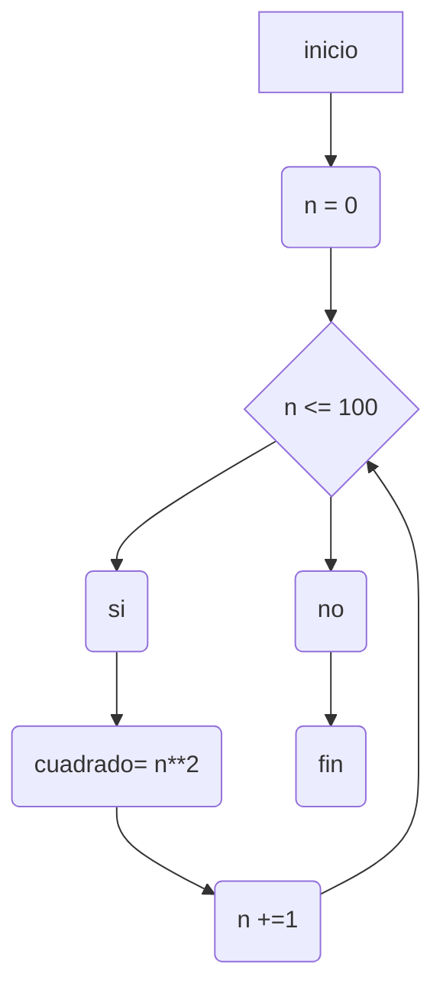
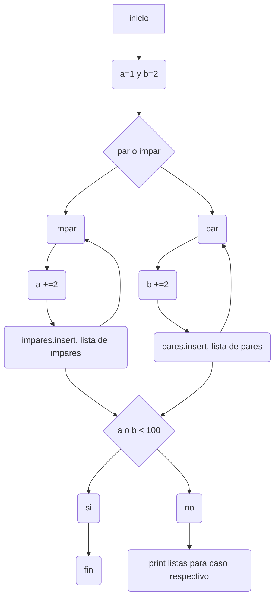
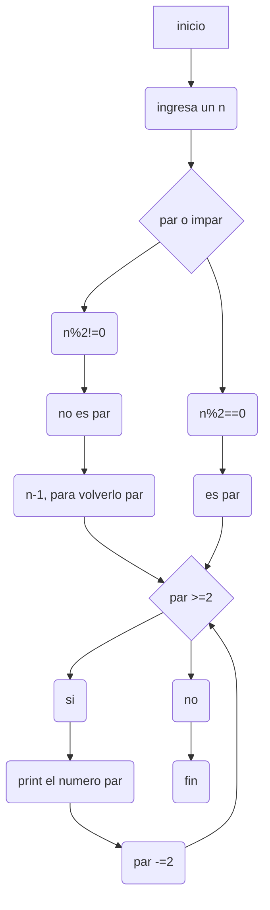

# Reto_7

Link notebook: https://colab.research.google.com/drive/1RwaDG6d9KHFItsneQf9vWUrGTBCN9G10?usp=sharing


1. Imprimir un listado con los números del 1 al 100 cada uno con su respectivo cuadrado.
   
-Diagrama de flujo:


programa: para este punto desarrolle un ciclo while que tiene en cuenta el conunto de los numeros de 1-100, el cual devuelve los cuadrados de el conjuto de numeros a evaluar (1-100)

```pseudocode
i =0
while (i<=100):
    cuadrado= (i**2)
    print( "el cuadrado de " +str(i)+ " es " +str(cuadrado))
    i +=1
```
2. Imprimir un listado con los números impares desde 1 hasta 999 y seguidamente otro listado con los números pares desde 2 hasta 1000.

-Diagrama de flujo:

programa: patra este programa desarrolle dos partes la primera es evaluar si el numero es par o si es impar, para posteriormente desarrollar dos listas que seran compartidas a el usuario al final mostrando los pares e impares presentes hasta 1000.

```pseudocode
a=1
b=2

impares=[]
pares=[]

while (a<999):
    impares.insert(0,a)
    a +=2

while (b<1000):
    pares.insert(0,b)
    b +=2

print("los numeros impares de forma descendente son")
for m in impares:
    print(m)

print("los numeros pares de forma descendente son")
for n in pares:
    print(n)
```
3.Imprimir los números pares en forma descendente hasta 2 que son menores o iguales a un número natural n ≥ 2 dado

-Diagrama de flujo:

programa: para este punto dividi el desarrollo en dos partes la primera corresponde a identificar si el n es par o impar, en caso de ser impar se transforma en par dada una instruccion; esto con el fin de posteriormente crear un ciclo while el cual mostrara los pares de forma decendente al ir restando 2 a cada casp evaluado

```pseudocode
n:int
n= int(input("ingresa el numero del cual quieres los numeros pares descendentes: "))
if n%2==0:
    par=n
else:
    par=n-1

pares=[]

while par >=2:
    pares.insert(0,par)
    print(par)
    par -=2
```
4.En 2022 el país A tendrá una población de 25 millones de habitantes y el país B de 18.9 millones. Las tasas de crecimiento anual de la población serán de 2% y 3% respectivamente. Desarrollar un algoritmo para informar en que año la población del país B superará a la de A.

programa: para el desarrollo del programa primero tome en cuenta la relacion de aumento porcentual, esto con el fin de poder crear un ciclo que va a evluar la tasa de aumento indivudual hasta tener un caso de parada, teniendo en cuenta los factores solicitados numero de poblacion y año en que se cumple la condicion.

```pseudocode
a=25000000
b=18900000
c=2022

años=True
aumento_a= 1+ a*0.02
aumento_b= b*0.03

while (b<a) and años:
    if (b>=a) and años:
        break
    a +=aumento_a
    b +=aumento_b
    c +=1
    print("la poblacion a es " +str(a)+ " y la poblacion b es " +str(b) + " para el año " +str(c))
```
5.Imprimir el factorial de un número natural n dado.

programa: la solucion de este punto recae en un ciclo while, el cual va a multiplicar cierta cantidad de numeros hasta igular el numero dado por el usuario 

```pseudocode
n= int(input("ingresa el numero del cual quieres el factorial: "))
i=1
factorial=1

while i<=n:
    factorial *= i
    i +=1
   
print("el factorias de " +str(n)+ " es " +str(factorial))
```
6.Implementar un algoritmo que permita adivinar un número dado de 1 a 100, preguntando en cada caso si el número es mayor, menor o igual.

programa: el desarrollo de este programa se dio a partir de la generacion por parte de la funcion random.randint de un dato aleatorio dado un rango de accion, posteriormente se entra a evaluar el hecho de si el numero es mayor, menor o igual para asi dar con una respuesta o con el calculo de un nuevo numero aleatorio.

```pseudocode
import random
def Adivinar():
    min=1
    max=100
    while True:
        Numero = random.randint(min, max) 
        print("tu numero es "+ str(Numero)+", si no lo es ¿tu numero es mayor, menor o igual?")
        Respuesta = input()
        
        if Respuesta == "igual":
            print("obviamente sabia cual era el numero")
            break
        elif Respuesta == "mayor":
            min= Numero +1   
        elif Respuesta == "menor":
            max= Numero -1
        else:
            break

Adivinar()
```
7.Implementar un programa que ingrese un número de 2 a 50 y muestre sus divisores.

programa: para este punto tome en cuenta el criterio que vuelve un numero divisor de otro, esto con el fin de implementarlo en un ciclo while en el cual dado cuero numero evaluara de manera individual cad numero para determinar si es un divisor o si no.

```pseudocode
n= int(input("ingresa un numero del 2 al 50: "))
i=1

while i<=n:
    if n%i ==0 :
        print(i)
    i +=1
```
8.Implementar el algoritmo que muestre los números primos del 1 al 100. Nota: use funciones

programa: por ultimo para este punto desarrolle un programa basado en que un numero primo solo es divisible entre si mismo, dada esta condicion se puede generar una evaluacion general hacia cierto rango de numeros, dando como resultado los numero primos hasta el 100

```pseudocode
def es_primo(num):
  if num<2:
    return False
  for i in range(2, num):
    if num % i==0:
      return False
  return True

for num in range(1,101):
  if es_primo(num):
    print (num)
```
gracias por leer hasta aqui 
